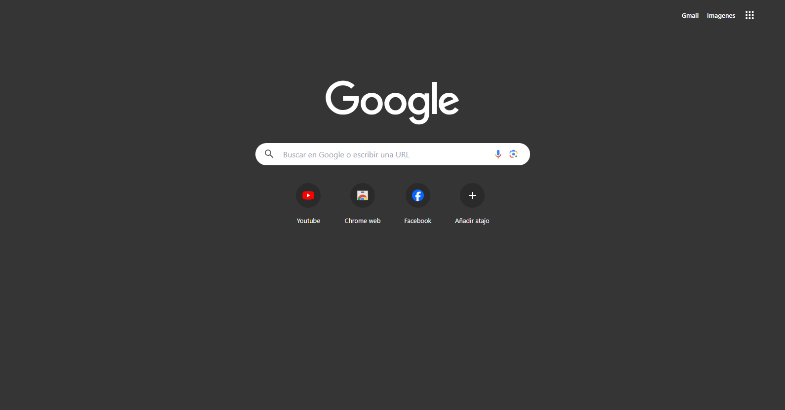

# Clon de la interfaz principal de Google
Este proyecto busca recrear el estilo frontend de la página principal de Google. Ha sido desarrollado con el propósito de poner en práctica mis habilidades en desarrollo web, utilizando la biblioteca Tailwind. La interfaz incorpora los colores, componentes e iconos característicos de Google para lograr una similitud visual cercana. Además, está diseñada para ser totalmente adaptable a dispositivos de todos los tamaños, incluyendo móviles

## 💻 Tecnologias:
- Tailwind (biblioteca)
- Html

No tiene ninguna funcionabilidad es solo elementos y estilos.
## 🖼 interfaz:

